# Lab 1: Introduction to AWS IAM
**AWS Identity and Access Management (IAM)** is a web service that enables Amazon Web Services (AWS) customers to manage users and user permissions in AWS. With IAM, you can centrally manage **users**, **security credentials** such as access keys, and **permissions** that control which AWS resources users can access.

## Lab overview and objectives
This lab will demonstrate:

*   Exploring pre-created **IAM Users and Groups**    
*   Inspecting **IAM policies** as applied to the pre-created groups
*   Following a **real-world scenario**, adding users to groups with specific capabilities enabled
*   Locating and using the **IAM sign-in URL**    
*   **Experimenting** with the effects of policies on service access
    

## AWS service restrictions
In this lab environment, access to AWS services and service actions might be restricted to the ones that are needed to complete the lab instructions. You might encounter errors if you attempt to access other services or perform actions beyond the ones that are described in this lab.

## AWS Identity and Access Management
AWS Identity and Access Management (IAM) can be used to:

*   **Manage IAM Users and their access:** You can create Users and assign them individual security credentials (access keys, passwords, and multi-factor authentication devices). You can manage permissions to control which operations a User can perform.    
*   **Manage IAM Roles and their permissions:** An IAM Role is similar to a User, in that it is an AWS identity with permission policies that determine what the identity can and cannot do in AWS. However, instead of being uniquely associated with one person, a Role is intended to be _assumable_ by anyone who needs it.
*   **Manage federated users and their permissions:** You can enable _identity federation_ to allow existing users in your enterprise to access the AWS Management Console, to call AWS APIs and to access resources, without the need to create an IAM User for each identity.
    
## Task 1: Explore the Users and Groups
### IAM users
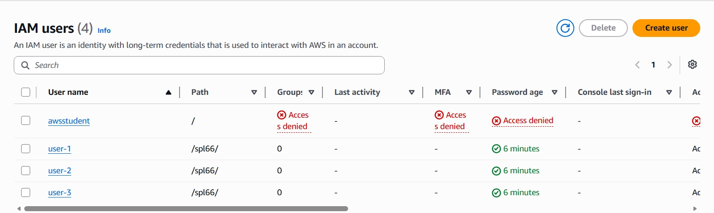
### IAM user groups
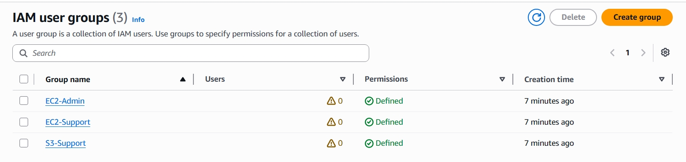

## Business Scenario
Your company is growing its use of Amazon Web Services, and is using many Amazon EC2 instances and a great deal of Amazon S3 storage. You wish to give access to new staff depending upon their job function:

| User   | In Group    | Permissions                               |
| :----: |:----------: |:-----------------------------------------:|
| user-1 | S3-Support  | Read-Only access to Amazon S3             |
| user-2 | EC2-Support | Read-Only access to Amazon EC2            |
| user-3 | EC2-Admin   | View, Start and Stop Amazon EC2 instances |

## Task 2: Add Users to Groups
add **user-1** to **S3-Support** group
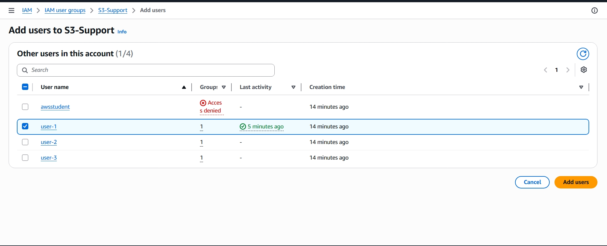
add **user-2** to **EC2-Support** group
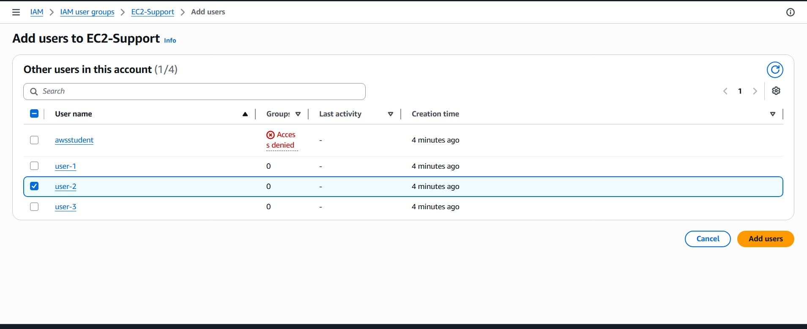
add **user-3** to **EC2-Admin** group
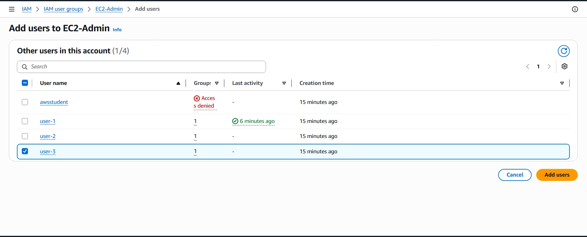
**final result**
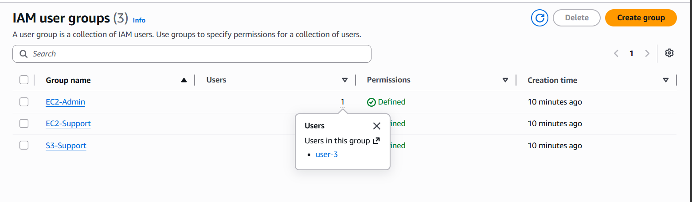
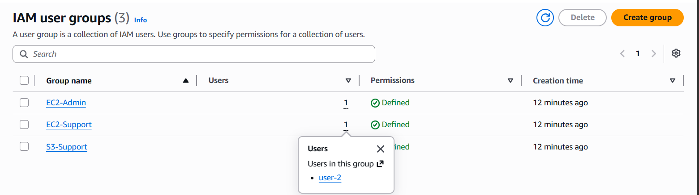
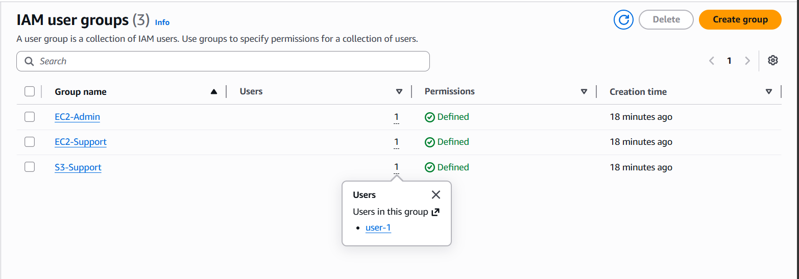

## Task 3: Sign-In and Test Users
### testing user-1
user can **Read-Only** access to Amazon **S3**
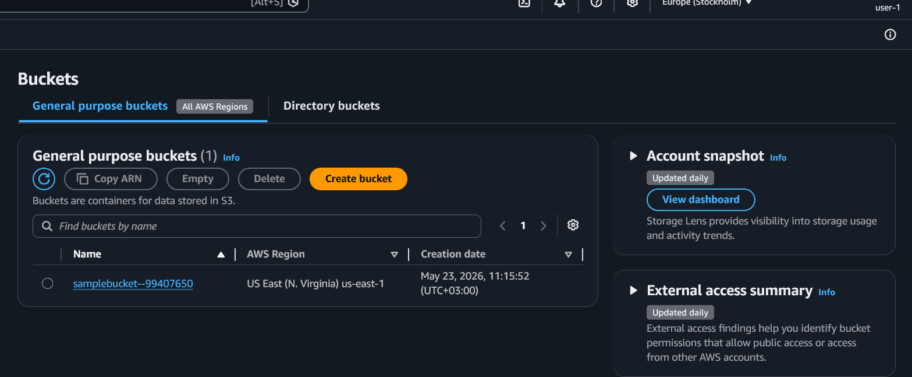
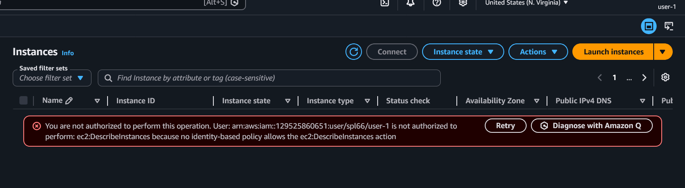

### testing user-2
user can **Read-Only** access to Amazon **EC2**
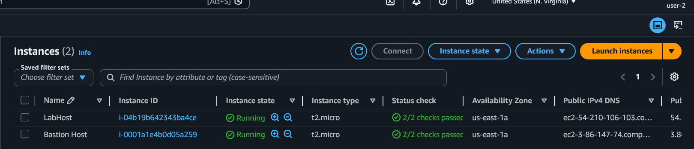
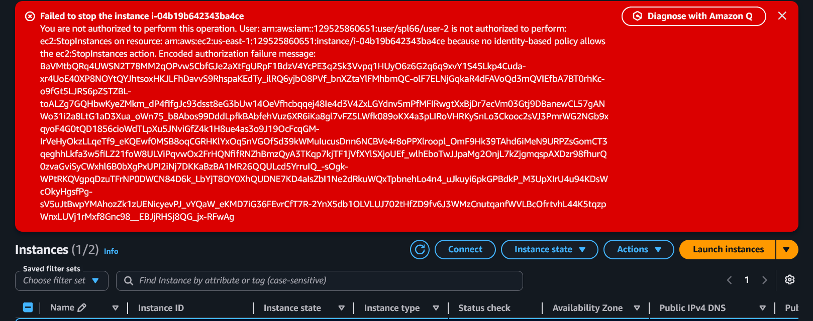
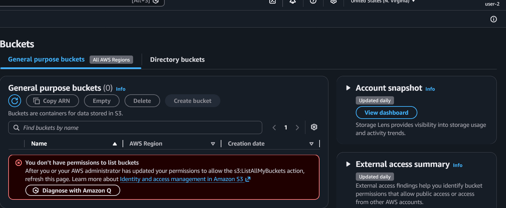

### testing user-2
user can **View, Start and Stop** Amazon **EC2** instances
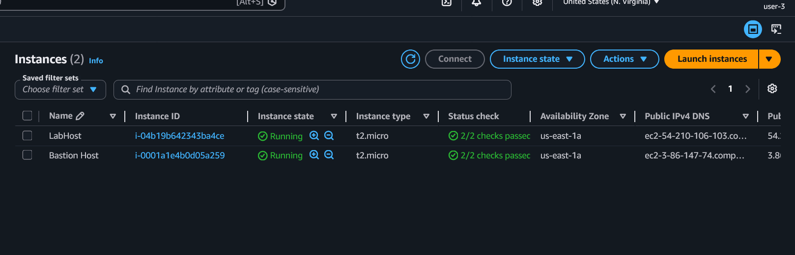
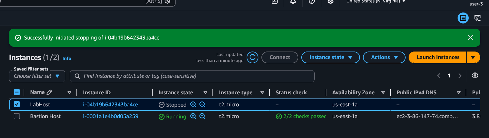