# Lab 3: Introduction to Amazon EC2

## Lab overview and objectives

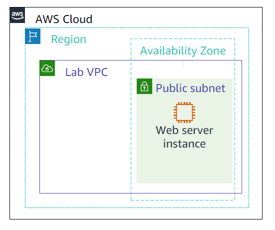

## Task 1: Launch Your Amazon EC2 Instance

In this task, you will launch an Amazon EC2 instance with _termination protection_ and _stop protection_. Termination protection prevents you from accidentally terminating the EC2 instance and stop protection prevents you from accidentally stopping the EC2 instance. You will also specify a User Data script when you launch the instance that will deploy a simple web server.

### Step 1: Name and tags

1. Give the instance the name `Web Server`.

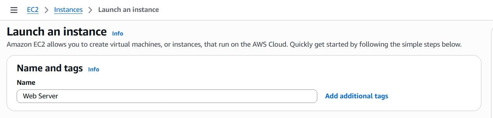

### Step 2: Application and OS Images (Amazon Machine Image)

2. In the list of available _Quick Start_ AMIs, keep the default **Amazon Linux** AMI selected.

3. Also keep the default **Amazon Linux 2023 AMI** selected.

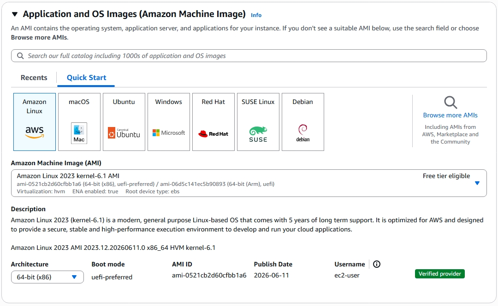

### Step 3: Instance type

4. In the _Instance type_ panel, keep the default **t2.micro** selected.

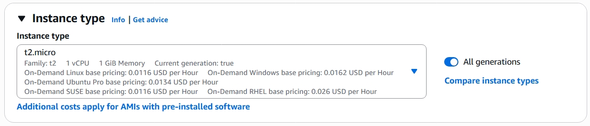

### Step 4: Key pair (login)

5. For **Key pair name** _vockey_.

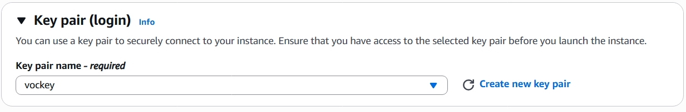

### Step 5: Network settings

6. For **VPC**, select **Lab VPC**.

7. Keep the default subnet **PublicSubnet1**.

8. Under **Firewall (security groups)**, choose **Create security group** and configure:
   - **Security group name:** `Web Server security group`
   - **Description:** `Security group for my web server`
   - Under **Inbound security group rules**, notice that one rule exists. **Remove** this rule.

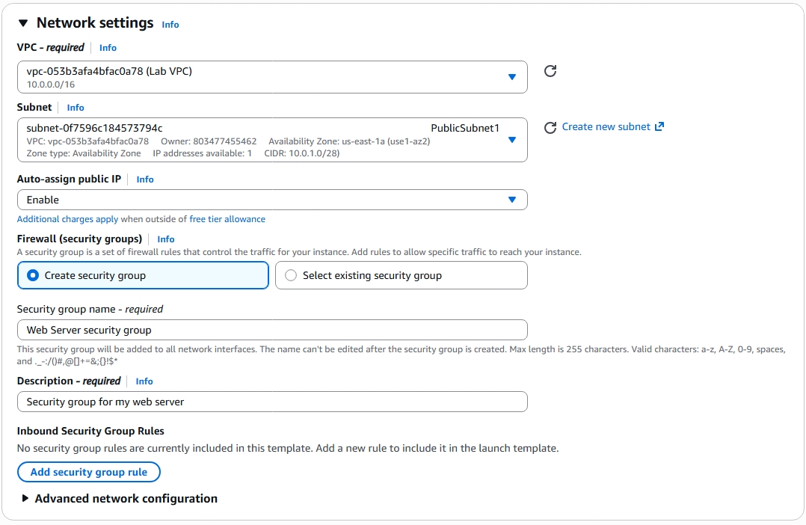

### Step 6: Configure storage

9. In the _Configure storage_ section, keep the default settings.

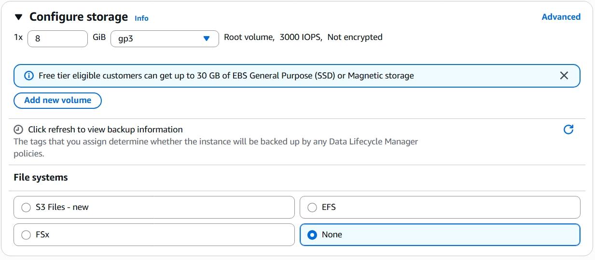

### Step 7: Advanced details

10. Expand **Advanced details**.

11. For **Termination protection**, select **Enable**.

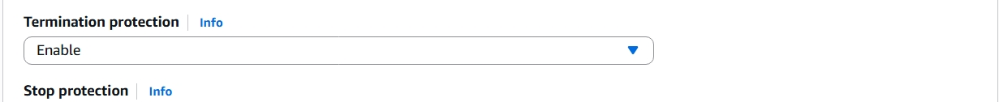

12. **User data:**

```bash
    #!/bin/bash
    dnf install -y httpd
    systemctl enable httpd
    systemctl start httpd
    echo '<html><h1>Hello From Your Web Server!</h1></html>' > /var/www/html/index.html
```

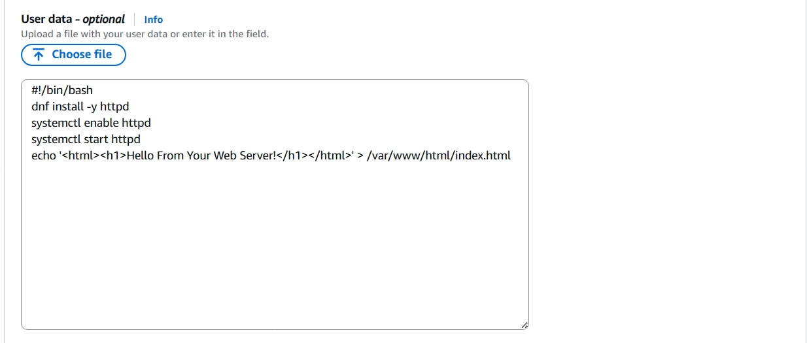

### Step 8: Launch the instance

13. At the bottom of the **Summary** panel choose Launch instance

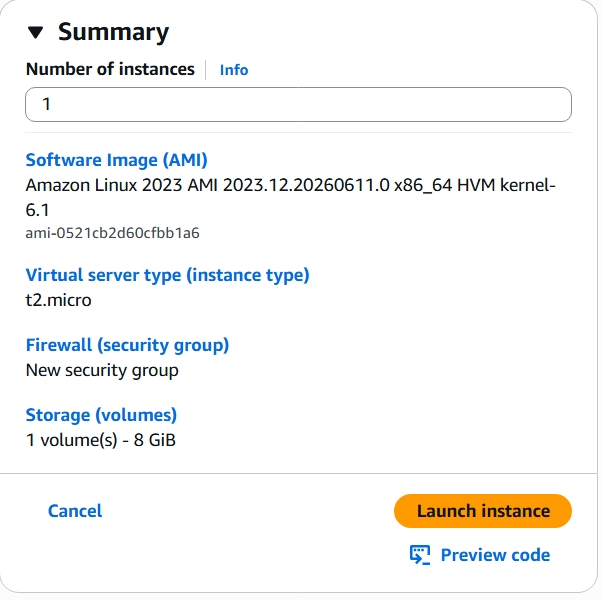

## Task 2: Monitor Your Instance

Monitoring is an important part of maintaining the reliability, availability, and performance of your Amazon Elastic Compute Cloud (Amazon EC2) instances and your AWS solutions.

14. In the Actions menu towards the top of the console, select **Monitor and troubleshoot** **Get system log**.

    The System Log displays the console output of the instance, which is a valuable tool for problem diagnosis. It is especially useful for troubleshooting kernel problems and service configuration issues that could cause an instance to terminate or become unreachable before its SSH daemon can be started. If you do not see a system log, wait a few minutes and then try again.

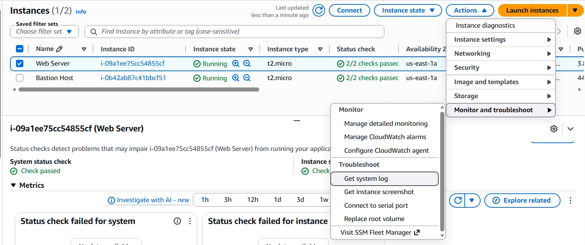
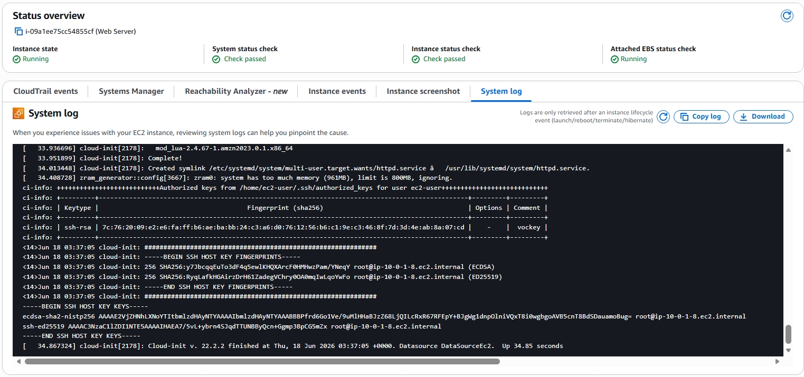

15. Ensure **Web Server** is still selected. Then, in the Actions menu, select **Monitor and troubleshoot** **Get instance screenshot**.

    This shows you what your Amazon EC2 instance console would look like if a screen were attached to it.

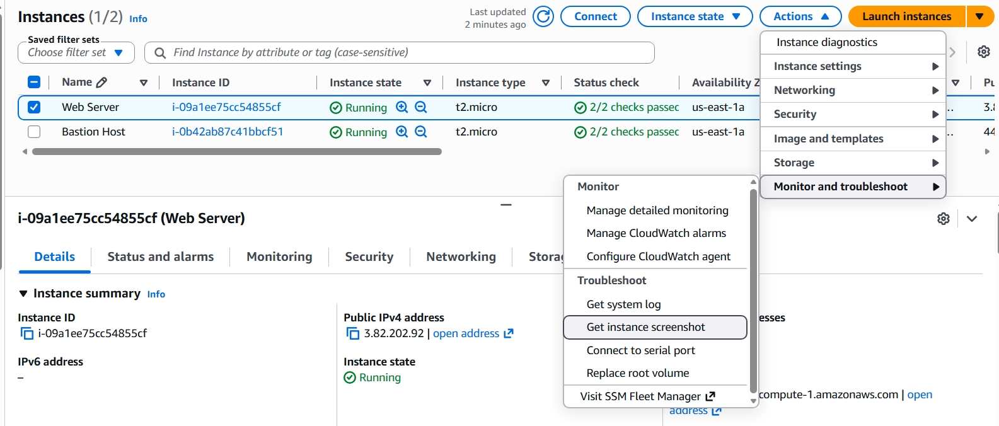
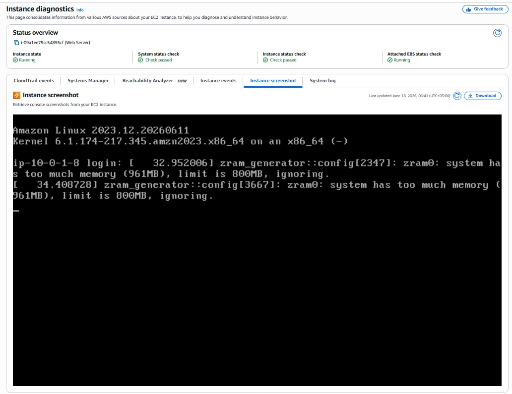

 

## Task 3: Update Your Security Group and Access the Web Server

When you launched the EC2 instance, you provided a script that installed a web server and created a simple web page. In this task, you will access content from the web server.

16. Ensure **Web Server** is still selected. Choose the **Details** tab.
    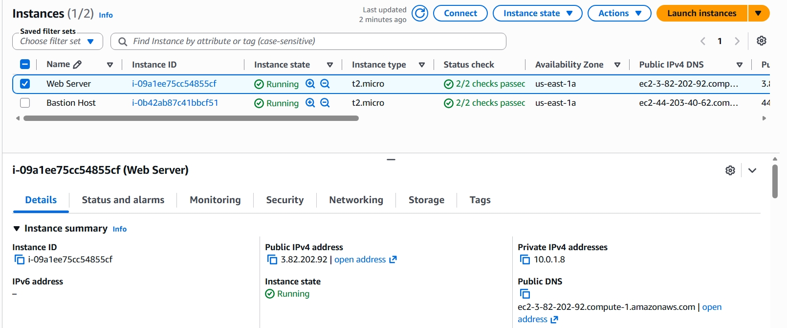

17. In the left navigation pane, choose **Security Groups**.

18. Select **Web Server security group**.

19. Choose the **Inbound rules** tab.
    The security group currently has no inbound rules.

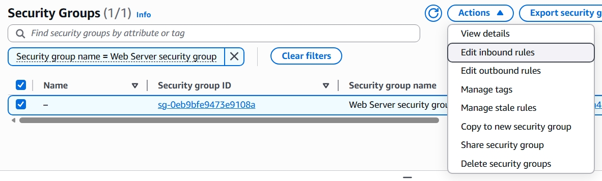

20. Choose Edit inbound rules, select Add rule and then configure:
    - **Type:** _HTTP_
    - **Source:** _Anywhere-IPv4_
    - Choose Save rules

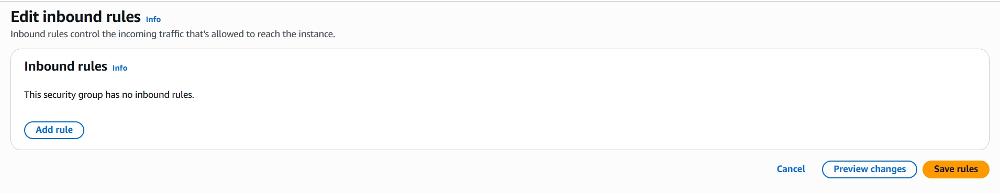
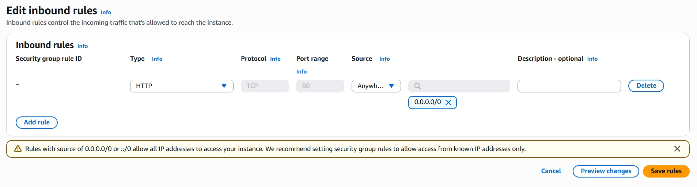

**Congratulations!** You have successfully modified your security group to permit HTTP traffic into your Amazon EC2 Instance.

 

## Task 4: Resize Your Instance: Instance Type and EBS Volume

As your needs change, you might find that your instance is over-utilized (too small) or under-utilized (too large). If so, you can change the _instance type_. For example, if a _t2.micro_ instance is too small for its workload, you can change it to an _m5.medium_ instance. Similarly, you can change the size of a disk.

 

### Stop Your Instance

Before you can resize an instance, you must _stop_ it.

When you stop an instance, it is shut down. There is no runtime charge for a stopped EC2 instance, but the storage charge for attached Amazon EBS volumes remains.

21. On the **EC2 Management Console**, in the left navigation pane, choose **Instances** and then select the **Web Server** instance.

22. In the Instance state  menu, select **Stop instance**.
    
    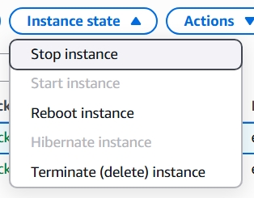
    
    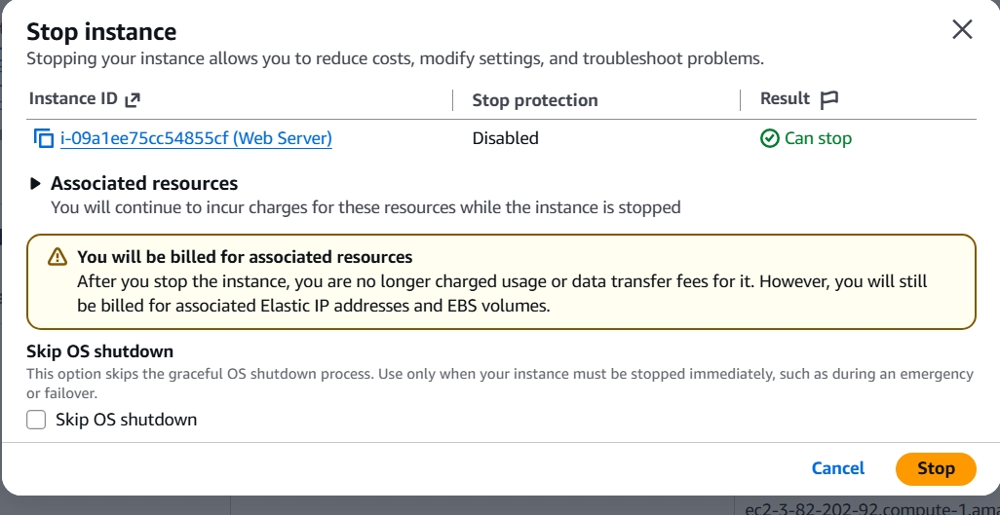

23. Wait for the **Instance state** to display: _Stopped_.
    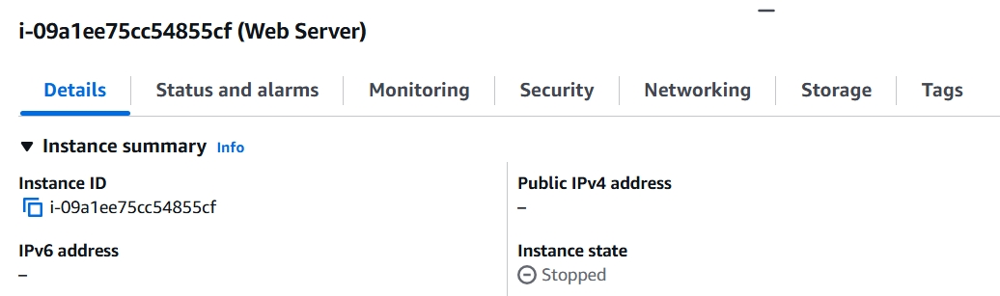

### Change The Instance Type and enable stop protection

24. Select the Web Server instance, then in the Actions menu, select **Instance settings** **Change instance type**, then configure: - **Instance Type:** _t2.small_ - Choose Apply
    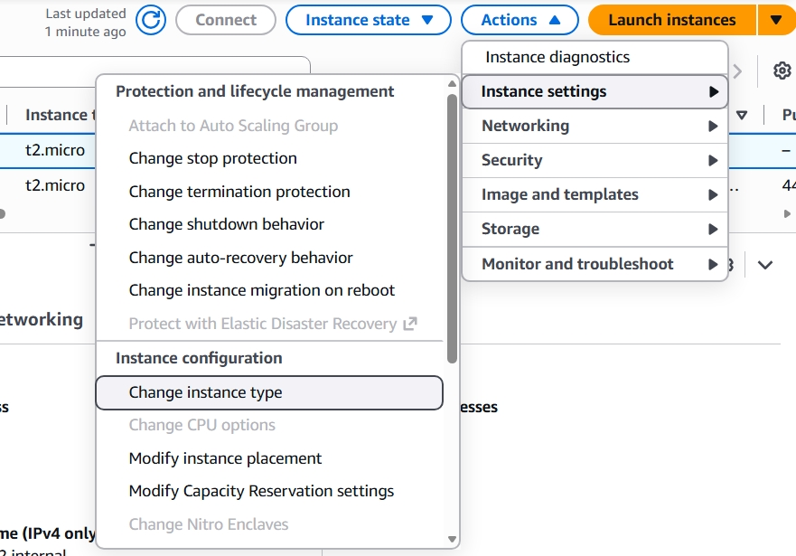
    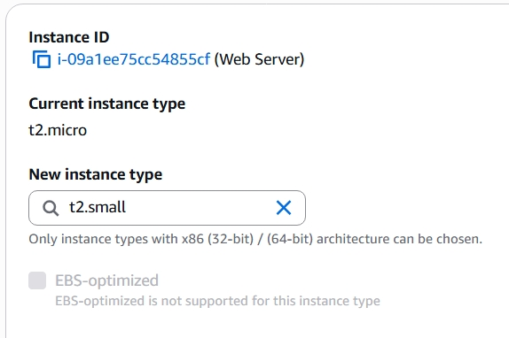

25. Select the Web Server instance, then in the Actions menu, select **Instance settings** **Change stop protection**. Select **Enable** and then Save the change.
    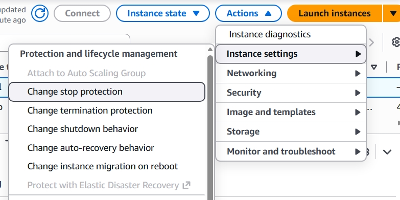
    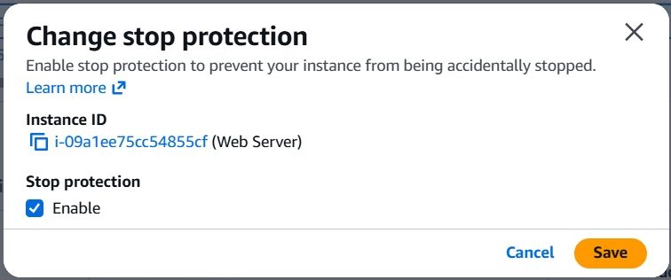

### Resize the EBS Volume

26. With the Web Server instance still selected, choose the **Storage** tab, select the name of the Volume ID, then select the checkbox next to the volume that displays.

27. In the Actions menu, select **Modify volume**.

    The disk volume currently has a size of 8 GiB. You will now increase the size of this disk.
    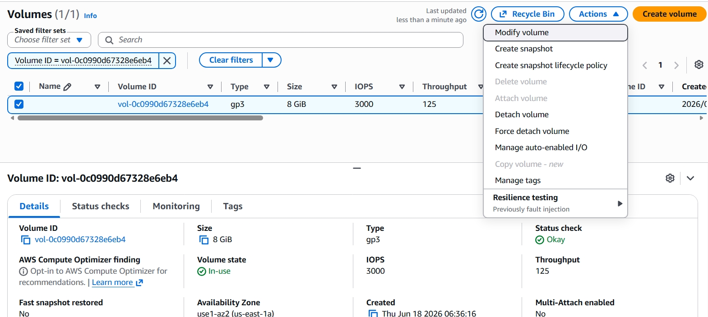

28. Change the size to: `10`
    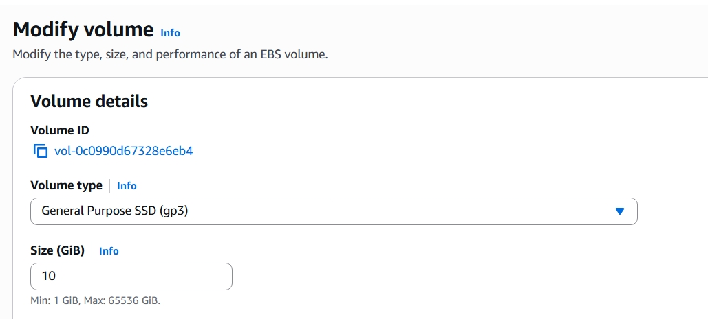

29. Choose Modify
    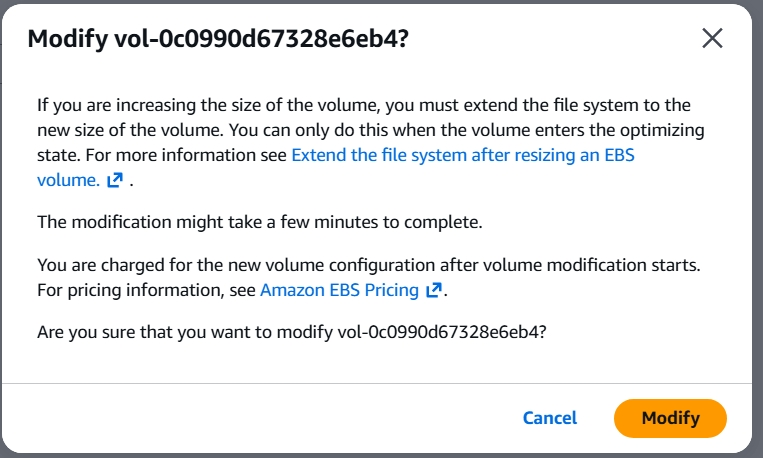

30. Choose Modify again to confirm and increase the size of the volume.
    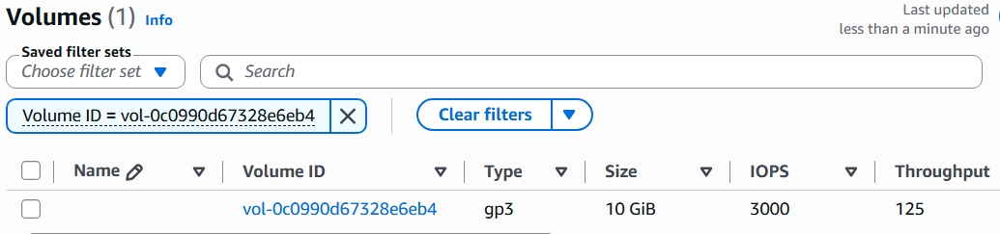

### Start the Resized Instance

You will now start the instance again, which will now have more memory and more disk space.

31. In left navigation pane, choose **Instances**.
32. Select the **Web Server** instance.
33. In the Instance state menu, select **Start instance**.

    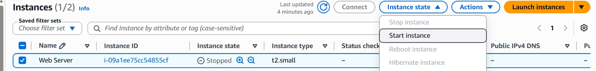

    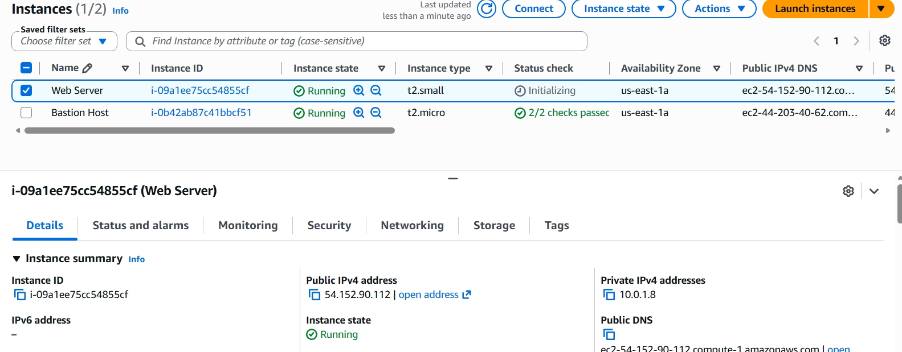

## Task 5: Explore EC2 Limits

Amazon EC2 provides different resources that you can use. These resources include images, instances, volumes, and snapshots. When you create an AWS account, there are default limits on these resources on a per-region basis.

 

34. In the AWS Management Console, in the search box next to **Services**, search for and choose `Service Quotas`
35. Choose **AWS services** from the navigation menu and then in the AWS services _Find services_ search bar, search for `ec2` and choose **Amazon Elastic Compute Cloud (Amazon EC2)**.
36. In the _Find quotas_ search bar, search for `running on-demand`, but do not make a selection. Instead, observe the filtered list of service quotas that match the criteria.

        Notice that there are limits on the number and types of instances that can run in a region. For example, there is a limit on the number of _Running On-Demand Standard..._ instances that you can launch in this region. When launching instances, the request must not cause your usage to exceed the instance limits currently defined in that region.

        If you are the AWS account owner, you can request an increase for many of these limits.

    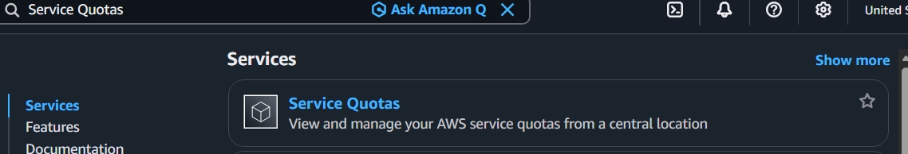
    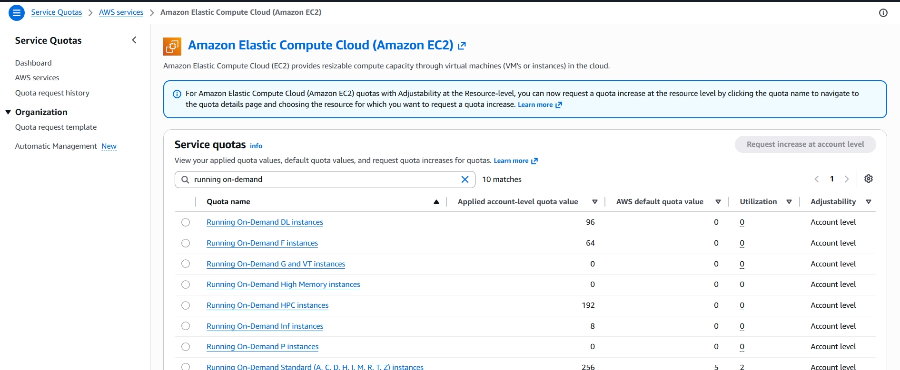

## Task 6: Test Stop Protection

You can stop your instance when you do not need to access but you would still like to retain it. In this task, you will learn how to use _stop protection_.

 

37. Select the **Web Server** instance and in the Instance state menu, select **Stop instance**.

38. Then choose Stop

    Note that there is a message that says: _Failed to stop the instance i-1234567xxx. The instance 'i-1234567xxx' may not be stopped. Modify its 'disableApiStop' instance attribute and try again._

    This shows that the stop protection that you enabled earlier in this lab is now providing a safeguard to prevent the accidental stopping of an instance. If you really want to stop the instance, you will need to disable the stop protection.

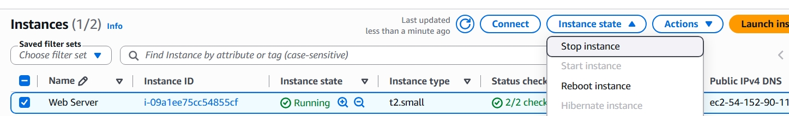
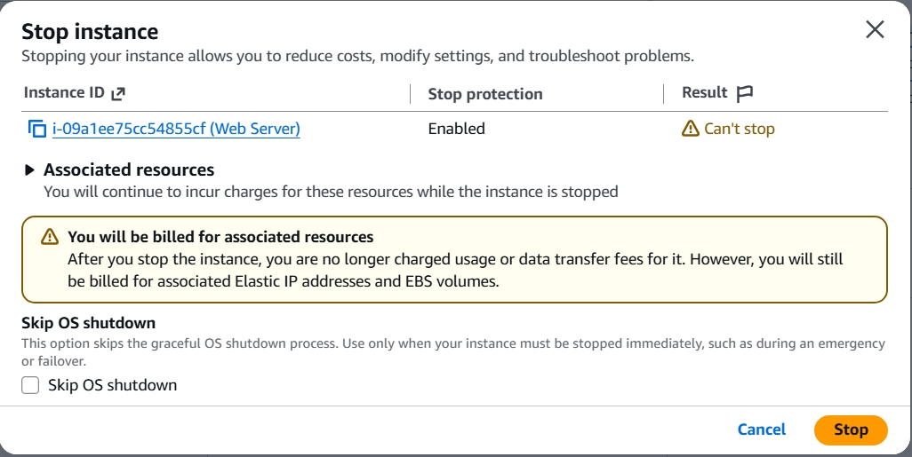
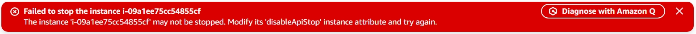

39. In the Actions menu, select **Instance settings** **Change stop protection**.
    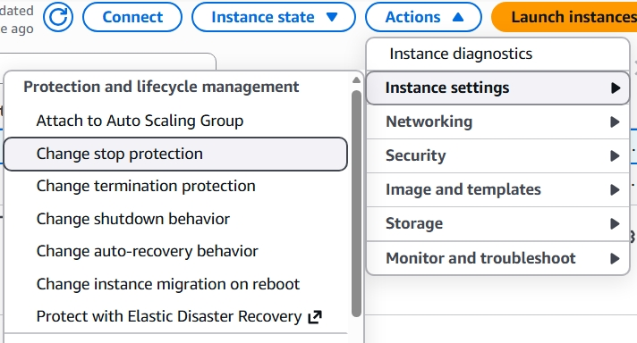

40. Remove the check next to **Enable**.
    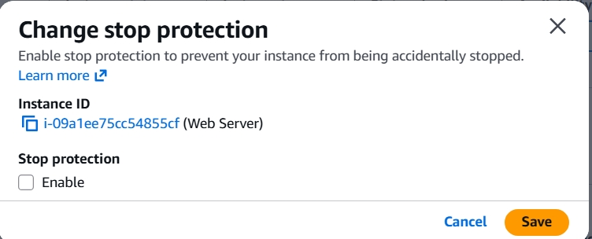


41. Select the **Web Server** instance again and in the Instance state menu, select **Stop instance**.
    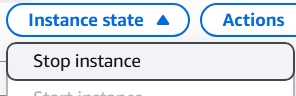
    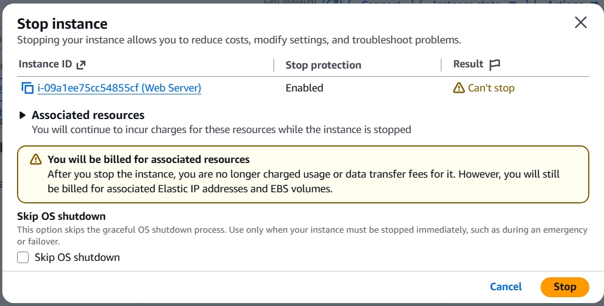
    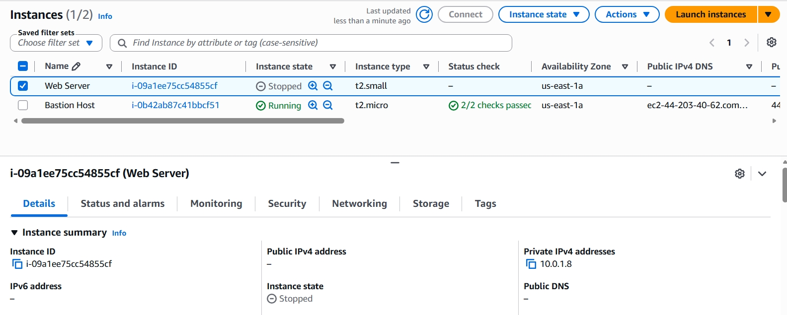

## Lab 3: Final product


